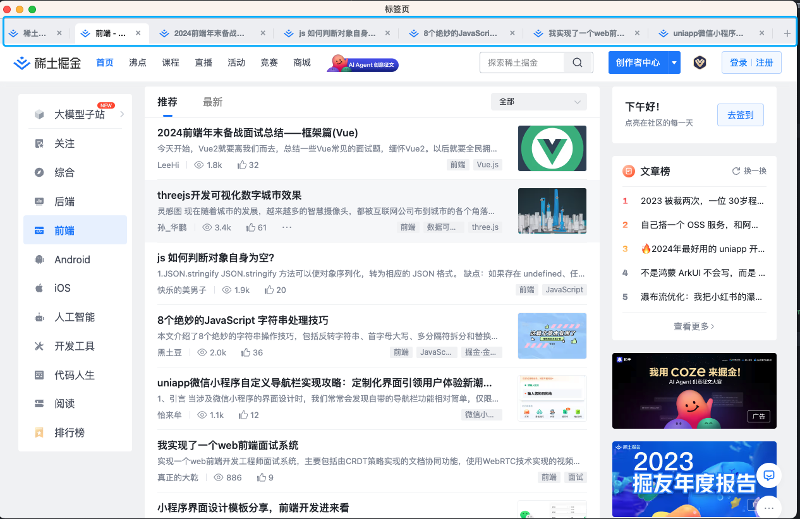
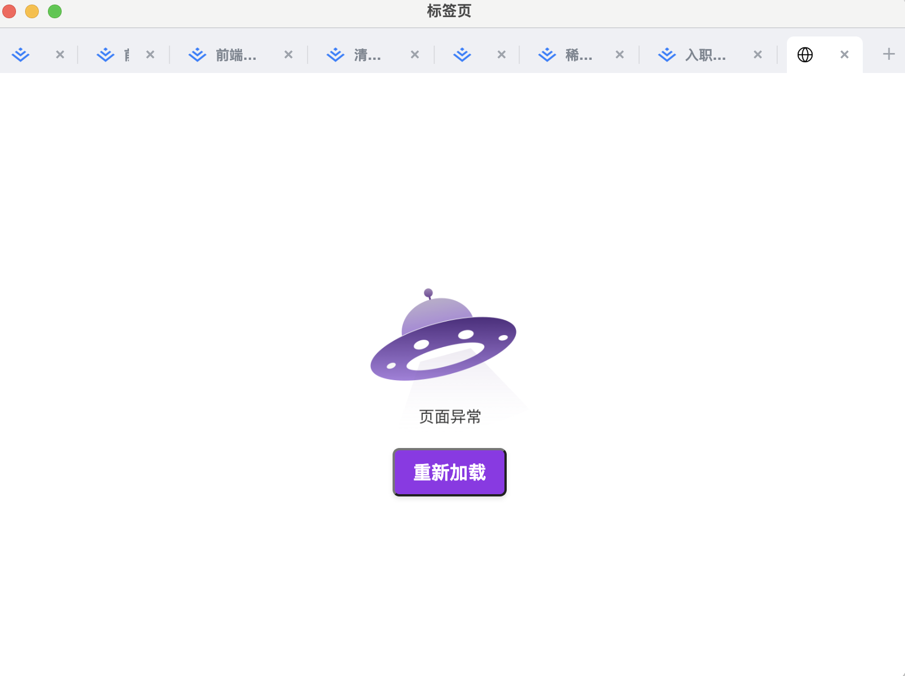

# electron-tab-containers

基于BrowserView，实现多标签页的。

## Feature 

### 优化tab页签

- 调整页签css，使其自适应，去掉滚动条

#### 增加简单窗口管理 

#### 渲染层多页管理

- 基于[vite多页面应用模式](https://cn.vitejs.dev/guide/build.html#multi-page-app)
- 增加错误页面，添加重新加载功能

#### 增加electron-builder打包配置

## 效果图






## 启动项目

```bash
[npm|yarn|pnpm] run dev
```


